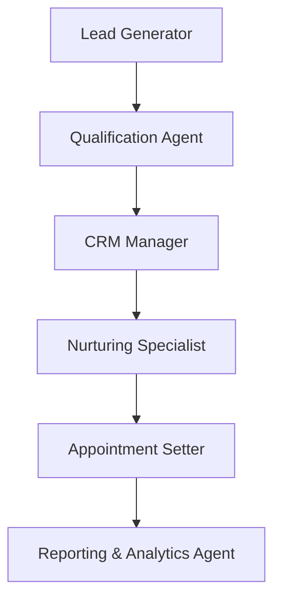

# Lead Management AI System

[](https://opensource.org/licenses/MIT)
[](https://www.python.org/)
[](https://fastapi.tiangolo.com/)

A real, working 6-agent lead processing pipeline built on [Agno](https://github.com/agno-agi/agno) + Claude, with FastAPI endpoints and analytics computed from actual runs.

**Abderrahman** - [GitHub](https://github.com/abdobzx)

## What's actually here

Six specialized Agno agents process a lead sequentially - Lead Generator, Qualification Agent, CRM Manager, Nurturing Specialist, Appointment Setter, and Reporting & Analytics Agent:



Each hop uses a reason-first, faithful-extraction handoff (see [`agents/orchestrator.py`](agents/orchestrator.py)) instead of passing one agent's raw text straight into the next: the producing agent's full response is captured, then a lightweight second pass restates the specific facts (scores, thresholds, statuses) the next agent needs, explicitly instructed not to invent caveats or drop precision. This is the same handoff pattern validated in [reasonrelay](https://github.com/abdobzx/reasonrelay), applied here to a real business pipeline instead of a synthetic benchmark.

Real per-stage token/latency metrics are recorded from Agno's own `RunOutput.metrics` and exposed via `/analytics/agents` - a fresh instance reports `runs: 0` and `null` averages until a lead has actually been processed, not a pre-filled fake number.

### Agents

1. **Lead Generator** - captures and enriches a lead's profile
2. **Qualification Agent** - scores financial capacity and readiness
3. **CRM Manager** - manages the contact record, triggers engagement sequences
4. **Nurturing Specialist** - builds and tracks personalized outreach
5. **Appointment Setter** - monitors readiness signals, schedules consultations
6. **Reporting & Analytics Agent** - summarizes the outcome and next steps

Each agent's tools (`web_search`, `data_enrichment`, `crm_sync`, etc.) are simulated - they return realistic-looking placeholder data rather than calling real external APIs, since there's no live CRM/calendar/credit-bureau integration behind this. That's clearly marked in each tool's code (`# In production: ...`) and is an honest limitation, not something papered over.

## Technology Stack

- **AI Framework**: [Agno 2.0.3](https://github.com/agno-agi/agno) - agent orchestration
- **LLM**: Claude Haiku (`claude-haiku-4-5-20251001`) via `agno.models.anthropic`
- **Backend**: FastAPI, async
- **Data layer**: in-memory dict for this demo (`leads_db` in `app/api/v1/endpoints/leads.py`) - not yet backed by the Postgres/SQLAlchemy/Alembic setup that exists in `app/core/database.py` and `requirements.txt`; wiring that up is a real next step, not done yet
- **Testing**: pytest (`tests/`)

## Quick Start

```bash
git clone https://github.com/abdobzx/Lead_Management.git
cd Lead_Management

python3 -m venv .venv
source .venv/bin/activate
pip install agno==2.0.3 anthropic pandas python-dotenv fastapi "uvicorn[standard]" pydantic pydantic-settings structlog redis sqlalchemy

cp .env.example .env
# set ANTHROPIC_API_KEY in .env - this is the one actually required to run the agents

uvicorn app.main:app --reload
```

Note on `requirements.txt`: it lists the full production dependency set (Postgres async driver, Redis, Docker/CI tooling, docs generator). `asyncpg` in particular doesn't currently build against newer Python versions (3.14+) - the install above is the minimal set needed to actually run the agent pipeline and API locally.

### Try it

```bash
# Create a lead
curl -X POST http://localhost:8000/api/v1/leads/ \
  -H "Content-Type: application/json" \
  -d '{"name": "Jane Investor", "email": "jane@example.com", "source": "website", "budget": 500000, "timeline": "3 months"}'

# Process it through the real 6-agent pipeline (takes ~60-90s, makes ~12-20 real API calls)
curl -X POST http://localhost:8000/api/v1/leads/{lead_id}/process

# See real, measured per-agent stats
curl http://localhost:8000/api/v1/analytics/agents
```

## Project structure

```text
agents/
  lead_generator.py, qualification_agent.py, crm_manager.py,
  nurturing_specialist.py, appointment_setter.py, reporting_analytics_agent.py
  orchestrator.py          # LeadPipeline: the actual sequential handoff logic
app/
  main.py                  # FastAPI app entry point
  api/v1/endpoints/         # leads.py, analytics.py, health.py
  core/                     # config, database, redis, pipeline_state (shared stats)
  models/                   # Pydantic Lead models
knowledge_base/             # real text files agents query via a knowledge_query tool
tests/                      # pytest suite
```

## Dashboard

`dashboard/app.py` is a real, working Streamlit frontend (~390 lines) that calls the actual API endpoints above - lead list, creation form, and a "process lead" button hitting the real pipeline. Run it with:

```bash
pip install streamlit plotly
streamlit run dashboard/app.py   # with the API running separately on :8000
```

## What this doesn't claim

- Not GDPR/SOC 2 compliant, no audit trail infrastructure, no rate limiting/DDoS protection actually wired up - those were previously listed as features and weren't real.
- No live external integrations (CRM, calendar, email sending, credit bureau) - all tool outputs are simulated, clearly marked in the code.
- No persistent database yet - leads live in an in-memory dict, reset on restart.
- A `/leads/export` endpoint and a separate installable Python SDK were referenced in an earlier version of this README but don't exist in the codebase - removed from the docs rather than left as unfulfilled promises.

## License

MIT - see [LICENSE](LICENSE).
