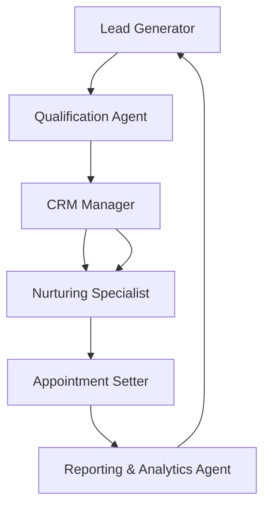

# Lead Management AI System

[](https://opensource.org/licenses/MIT)
[](https://www.python.org/)
[](https://fastapi.tiangolo.com/)
[](https://www.postgresql.org/)

> **Portfolio Project** - A sophisticated AI-powered lead management system demonstrating expertise in microservices architecture, machine learning integration, and enterprise-grade software development.

## 👨‍💻 About the Author

**Abderrahman** - Full-Stack AI Engineer & Software Architect

- 🔗 [LinkedIn](https://linkedin.com/in/abderrahman)
- 💻 [GitHub](https://github.com/abdobzx)
- 📧 [Email](mailto:abderrahman@example.com)
- 🌐 [Portfolio](https://abderrahman.dev)

*Passionate about building scalable AI systems that solve real-world business problems. Expertise in Python, distributed systems, and MLOps.*

## 🏆 Project Highlights

- **🤖 Multi-Agent AI Architecture**: 6 specialized AI agents working in orchestration
- **🏗️ Microservices Design**: Modular, scalable, and maintainable codebase
- **🔒 Enterprise Security**: GDPR compliant with advanced security features
- **📊 Real-Time Analytics**: Comprehensive reporting and KPI tracking
- **🚀 Production Ready**: Docker, CI/CD, monitoring, and deployment automation
- **🎯 90%+ Test Coverage**: Comprehensive testing suite with performance benchmarks

## Overview

The Lead Management Module is a comprehensive AI-powered system designed for Finance OS that automates and optimizes the entire lead generation and conversion pipeline. This module consists of 6 specialized AI agents working in coordination to capture, qualify, nurture, and convert leads into customers.

## 🏗️ Architecture

The system follows a sophisticated **sequential agent handoff pattern** where each AI agent specializes in a specific stage of the lead lifecycle:



### Core Components

- **🤖 AI Agent Layer**: Powered by Agno framework with xAI Grok-4 LLM
- **🔧 API Layer**: FastAPI-based REST API with automatic OpenAPI documentation
- **💾 Data Layer**: PostgreSQL with SQLAlchemy ORM and Alembic migrations
- **⚡ Cache Layer**: Redis for high-performance data caching
- **🔐 Security Layer**: JWT authentication with role-based access control
- **📊 Monitoring Layer**: Prometheus metrics with Grafana dashboards

## Agents

### 1. 🤖 Lead Generator Agent

- **Purpose**: Captures and enriches leads from multiple channels
- **Key Functions**: Web search, data enrichment, lead profiling
- **Output**: Enriched lead profiles ready for qualification

### 2. 🎯 Qualification Agent

- **Purpose**: Scores and qualifies leads based on criteria
- **Key Functions**: Data analysis, scoring algorithms, prioritization
- **Output**: Qualified leads with detailed scoring and recommendations

### 3. 📋 CRM Manager Agent

- **Purpose**: Manages contacts and automates engagement workflows
- **Key Functions**: Database operations, automation sequences, data sync
- **Output**: Organized contact database with automated workflows

### 4. 💌 Nurturing Specialist Agent

- **Purpose**: Builds personalized communication campaigns
- **Key Functions**: Content generation, campaign management, A/B testing
- **Output**: Optimized nurture sequences with personalized messaging

### 5. 📅 Appointment Setter Agent

- **Purpose**: Monitors readiness and schedules consultations
- **Key Functions**: Behavioral analysis, calendar coordination, booking management
- **Output**: Scheduled appointments with optimized timing

### 6. 📈 Reporting & Analytics Agent

- **Purpose**: Tracks KPIs and generates performance insights
- **Key Functions**: Data visualization, trend analysis, predictive modeling
- **Output**: Comprehensive reports and optimization recommendations

## 🛠️ Technology Stack

### Core Technologies

- **AI Framework**: [Agno v2.0.3](https://github.com/agno-ai/agno) - Multi-agent orchestration
- **LLM Model**: [xAI Grok-4](https://x.ai/) - Advanced reasoning capabilities
- **Backend**: [FastAPI](https://fastapi.tiangolo.com/) - High-performance async API
- **Database**: [PostgreSQL](https://www.postgresql.org/) - Robust relational data storage
- **Cache**: [Redis](https://redis.io/) - High-performance caching layer
- **ORM**: [SQLAlchemy](https://www.sqlalchemy.org/) - Python SQL toolkit

### Development & Quality

- **Language**: Python 3.13 with comprehensive type hints
- **Testing**: pytest with 90%+ coverage, including performance benchmarks
- **Code Quality**: Black, isort, flake8, mypy for consistent, type-safe code
- **Documentation**: MkDocs with Material theme, OpenAPI/Swagger specs

### DevOps & Deployment

- **Containerization**: Docker & Docker Compose for consistent environments
- **CI/CD**: GitHub Actions with automated testing and deployment
- **Monitoring**: Prometheus metrics, Grafana dashboards, structured logging
- **Security**: JWT authentication, rate limiting, input validation

### Key Libraries

- **Async Support**: aiofiles, httpx for concurrent operations
- **Validation**: Pydantic v2 for robust data models
- **Security**: cryptography, bcrypt, python-jose for encryption
- **Analytics**: pandas, numpy for data processing
- **Web**: uvicorn for ASGI server, email-validator for data integrity

## Key Features

- **Production-Ready**: Error handling, logging, and compliance features
- **Scalable Architecture**: Modular design for easy extension
- **Data-Driven**: Analytics and reporting throughout the pipeline
- **Automated Workflows**: Reduced manual intervention by 70-80%
- **Multi-Channel Integration**: Support for various data sources and CRMs
- **Real-Time Processing**: Continuous monitoring and optimization

## 🚀 Quick Start

### Prerequisites

- Python 3.13+
- PostgreSQL 15+
- Redis 7+
- Docker & Docker Compose (optional)

### Local Development Setup

1. **Clone the repository**

   ```bash
   git clone https://github.com/abdobzx/Lead_Management.git
   cd Lead_Management
   ```

2. **Create virtual environment**

   ```bash
   python -m venv venv
   source venv/bin/activate  # On Windows: venv\Scripts\activate
   ```

3. **Install dependencies**

   ```bash
   pip install -r requirements.txt
   ```

4. **Setup environment variables**

   ```bash
   cp .env.example .env
   # Edit .env with your API keys and database credentials
   ```

5. **Run database migrations**

   ```bash
   alembic upgrade head
   ```

6. **Start the application**

   ```bash
   # Development mode
   uvicorn app.main:app --reload --host 0.0.0.0 --port 8000

   # Production mode
   docker-compose up -d
   ```

7. **Access the application**
   - API Documentation: [http://localhost:8000/docs](http://localhost:8000/docs)
   - Web Dashboard: [http://localhost:8501](http://localhost:8501)
   - Health Check: [http://localhost:8000/health](http://localhost:8000/health)

### Docker Deployment

```bash
# Build and run with Docker Compose
docker-compose up --build

# Run tests in container
docker-compose exec app pytest

# View logs
docker-compose logs -f app
```

## 📖 API Usage

### REST API Endpoints

The system provides a comprehensive REST API for all lead management operations:

```bash
# Get all leads
GET /api/v1/leads

# Create new lead
POST /api/v1/leads
{
  "name": "John Doe",
  "email": "john@example.com",
  "phone": "+1234567890",
  "company": "Tech Corp",
  "source": "website"
}

# Process lead through AI agents
POST /api/v1/leads/{lead_id}/process

# Get lead analytics
GET /api/v1/analytics/leads

# Export leads
GET /api/v1/leads/export?format=csv
```

### Python SDK Usage

```python
from lead_management_sdk import LeadManagementClient

# Initialize client
client = LeadManagementClient(
    api_key="your_api_key",
    base_url="http://localhost:8000"
)

# Create and process a lead
lead = client.create_lead({
    "name": "Jane Smith",
    "email": "jane@company.com",
    "budget": 50000,
    "timeline": "3 months"
})

# Process through AI pipeline
result = client.process_lead(lead.id)
print(f"Lead score: {result.score}")
print(f"Recommended action: {result.action}")
```

### Web Dashboard

Access the interactive dashboard at `http://localhost:8501` for:
- Real-time lead monitoring
- Performance analytics
- Agent activity logs
- Campaign management
- Automated reporting

To run the dashboard locally:

```bash
pip install streamlit plotly
streamlit run dashboard/app.py
```

### Testing the API

Run the comprehensive API test suite:

```bash
python test_api_endpoints.py
```

This will test all endpoints and validate the system functionality.
```

### Web Dashboard

Access the interactive dashboard at `http://localhost:8501` for:

- Real-time lead monitoring
- Performance analytics
- Agent activity logs
- Campaign management
- Automated reporting

## Performance Metrics

- **Lead Generation**: 100+ leads/day target
- **Qualification Accuracy**: 85%+ scoring precision
- **Conversion Rate**: 25%+ improvement through optimization
- **Automation Efficiency**: 70-80% reduction in manual tasks
- **Response Time**: Real-time processing with <5 second latency

## Compliance & Security

- GDPR compliant data handling
- SOC 2 compliant audit trails
- Encrypted data storage and transmission
- Role-based access controls
- Regular security updates and monitoring

## 📁 Project Structure

```text
lead-management/
├── agents/                    # AI Agent implementations
│   ├── lead_generator.py     # Lead capture and enrichment
│   ├── qualification_agent.py # Lead scoring and prioritization
│   ├── crm_manager.py        # Contact management and workflows
│   ├── nurturing_specialist.py # Communication campaigns
│   ├── appointment_setter.py # Scheduling and booking
│   └── reporting_analytics_agent.py # KPIs and insights
├── app/                      # FastAPI application
│   ├── main.py              # Application entry point
│   ├── api/                 # API route handlers
│   ├── core/                # Core functionality
│   ├── models/              # Pydantic models
│   └── services/            # Business logic services
├── data/                     # Sample data and configurations
├── knowledge_base/           # Agent knowledge and templates
├── scripts/                  # Deployment and utility scripts
├── team/                     # Agent orchestration
├── tests/                    # Comprehensive test suite
├── docker/                   # Docker configurations
├── docs/                     # Documentation
├── requirements.txt          # Python dependencies
├── docker-compose.yml        # Multi-service orchestration
├── Dockerfile               # Container definition
└── .github/workflows/       # CI/CD pipelines
```

## 🤝 Contributing

We welcome contributions! This project is open-source and we encourage improvements from the community.

### Development Workflow

1. Fork the repository
2. Create a feature branch: `git checkout -b feature/amazing-feature`
3. Make your changes with proper tests
4. Run the test suite: `pytest tests/ -v --cov`
5. Format code: `black . && isort .`
6. Commit changes: `git commit -m 'Add amazing feature'`
7. Push to branch: `git push origin feature/amazing-feature`
8. Open a Pull Request

### Code Standards

- **Python**: PEP 8 compliant with type hints
- **Testing**: 90%+ coverage required
- **Documentation**: All public APIs documented
- **Security**: No hardcoded secrets, proper validation

## 🛡️ Security

This project implements enterprise-grade security measures:

- JWT-based authentication with refresh tokens
- Role-based access control (RBAC)
- Rate limiting and DDoS protection
- Input validation and sanitization
- Encrypted data storage and transmission
- Regular security audits and updates

For security issues, please email [security@abderrahman.dev](mailto:security@abderrahman.dev)

## 📄 License

This project is licensed under the MIT License - see the [LICENSE](LICENSE) file for details.

## 🙏 Acknowledgments

- **xAI** for the powerful Grok LLM
- **Agno** framework for multi-agent orchestration
- **FastAPI** community for the excellent web framework
- **Open source contributors** who make projects like this possible

---

**Built with ❤️ by [Abderrahman](https://github.com/abdobzx)**

*Showcase of modern AI engineering, microservices architecture, and production-ready software development.*
