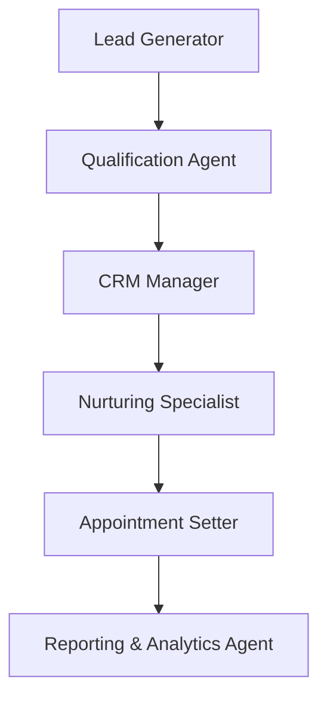

# Lead Management AI System

[](https://opensource.org/licenses/MIT)
[](https://www.python.org/)
[](https://fastapi.tiangolo.com/)

A real, working 6-agent lead processing pipeline built on [Agno](https://github.com/agno-agi/agno) + Claude, with FastAPI endpoints, real Postgres persistence, real JWT auth, and analytics computed from actual runs.

**Abderrahman** - [GitHub](https://github.com/abdobzx)

## What's actually here

Six specialized Agno agents process a lead sequentially - Lead Generator, Qualification Agent, CRM Manager, Nurturing Specialist, Appointment Setter, and Reporting & Analytics Agent:



Each hop uses a reason-first, faithful-extraction handoff (see [`agents/orchestrator.py`](agents/orchestrator.py)) instead of passing one agent's raw text straight into the next: the producing agent's full response is captured, then a lightweight second pass restates the specific facts (scores, thresholds, statuses) the next agent needs, explicitly instructed not to invent caveats or drop precision. This is the same handoff pattern validated in [reasonrelay](https://github.com/abdobzx/reasonrelay), applied here to a real business pipeline instead of a synthetic benchmark.

Real per-stage token/latency metrics are recorded from Agno's own `RunOutput.metrics` and exposed via `/analytics/agents` - a fresh instance reports `runs: 0` and `null` averages until a lead has actually been processed, not a pre-filled fake number.

### Agents

1. **Lead Generator** - captures and enriches a lead's profile
2. **Qualification Agent** - scores financial capacity and readiness
3. **CRM Manager** - manages the contact record, triggers engagement sequences
4. **Nurturing Specialist** - builds and tracks personalized outreach
5. **Appointment Setter** - monitors readiness signals, schedules consultations
6. **Reporting & Analytics Agent** - summarizes the outcome and next steps

Each agent's tools (`web_search`, `data_enrichment`, `crm_sync`, etc.) are simulated - they return realistic-looking placeholder data rather than calling real external APIs, since there's no live CRM/calendar/credit-bureau integration behind this. That's clearly marked in each tool's code (`# In production: ...`) and is an honest limitation, not something papered over.

## Technology Stack

- **AI Framework**: [Agno 2.0.3](https://github.com/agno-agi/agno) - agent orchestration
- **LLM**: Claude Haiku (`claude-haiku-4-5-20251001`) via `agno.models.anthropic`
- **Backend**: FastAPI, async
- **Data layer**: real Postgres, via SQLAlchemy 2.0 async ORM + Alembic migrations (`app/models/db_models.py`, `alembic/`). Verified to survive a full server restart - data is not in-memory. For quick local testing, `TESTING=true` swaps in an in-memory SQLite engine instead (same models, same code path).
- **Auth**: real JWT (`app/core/security.py`, `app/api/v1/endpoints/auth.py`) - register/login, bcrypt-hashed passwords, leads scoped per-user via `owner_id`. Basic on purpose: access tokens only, no refresh rotation, no RBAC - enough to make leads genuinely private per user, not "enterprise-grade security."
- **Testing**: pytest (`tests/`), 22 tests, all against the real DB/auth path

## Quick Start

```bash
git clone https://github.com/abdobzx/Lead_Management.git
cd Lead_Management

python3 -m venv .venv
source .venv/bin/activate
pip install -r requirements.txt   # asyncpg needs >=0.30.0 for prebuilt wheels on Python 3.14+, already reflected here

cp .env.example .env
# set ANTHROPIC_API_KEY (required to run the agents) and Postgres credentials

docker-compose up -d db            # or point POSTGRES_* at your own instance
alembic upgrade head                # creates the users/leads tables

uvicorn app.main:app --reload
```

### Try it

```bash
# Register and log in
curl -X POST http://localhost:8000/api/v1/auth/register -H "Content-Type: application/json" \
  -d '{"email": "agent@example.com", "password": "supersecret123"}'
TOKEN=$(curl -s -X POST http://localhost:8000/api/v1/auth/login \
  -d "username=agent@example.com&password=supersecret123" | python3 -c "import sys,json;print(json.load(sys.stdin)['access_token'])")

# Create a lead (requires auth)
curl -X POST http://localhost:8000/api/v1/leads/ -H "Content-Type: application/json" -H "Authorization: Bearer $TOKEN" \
  -d '{"name": "Jane Investor", "email": "jane@example.com", "source": "website", "budget": 500000, "timeline": "3 months"}'

# Process it through the real 6-agent pipeline (takes ~60-90s, makes ~12-20 real API calls)
curl -X POST http://localhost:8000/api/v1/leads/{lead_id}/process -H "Authorization: Bearer $TOKEN"

# See real, measured per-agent stats
curl http://localhost:8000/api/v1/analytics/agents -H "Authorization: Bearer $TOKEN"
```

## Project structure

```text
agents/
  lead_generator.py, qualification_agent.py, crm_manager.py,
  nurturing_specialist.py, appointment_setter.py, reporting_analytics_agent.py
  orchestrator.py          # LeadPipeline: the actual sequential handoff logic
alembic/                    # real migrations (was referenced in the README, didn't exist, now does)
app/
  main.py                  # FastAPI app entry point
  api/v1/endpoints/         # auth.py, leads.py, analytics.py, health.py
  core/                     # config, database, redis, security, deps, pipeline_state
  models/                   # lead.py (Pydantic API schemas), db_models.py (real SQLAlchemy tables)
knowledge_base/             # real text files agents query via a knowledge_query tool
tests/                      # pytest suite, 22 tests against real DB/auth
```

## Dashboard

`dashboard/app.py` is a real, working Streamlit frontend (~390 lines) that calls the actual API endpoints above - lead list, creation form, and a "process lead" button hitting the real pipeline. Run it with:

```bash
pip install streamlit plotly
streamlit run dashboard/app.py   # with the API running separately on :8000
```

## What this doesn't claim

Real now: persistent Postgres storage (survives restarts, verified), real JWT auth with per-user data isolation, real Alembic migrations.

Still not real, and worth being direct about before calling this "production ready":
- **No live external integrations.** CRM sync, calendar scheduling, and email sending are all simulated (`# In production: ...` in each tool) - there's no real SendGrid/Twilio/CRM account behind this. That's the single biggest gap left for an actual paying customer to rely on.
- **No refresh tokens, no RBAC, no rate limiting, no audit trail.** Auth is basic - real per-user isolation, nothing more. Not GDPR/SOC 2 compliant; those were previously listed as features here and weren't real.
- **No production hosting/monitoring/backup story.** Runs locally or in the provided `docker-compose.yml`; nothing here addresses uptime, backups, or scaling.
- A `/leads/export` endpoint and a separate installable Python SDK were referenced in an earlier version of this README but don't exist in the codebase - removed from the docs rather than left as unfulfilled promises.

## License

MIT - see [LICENSE](LICENSE).
